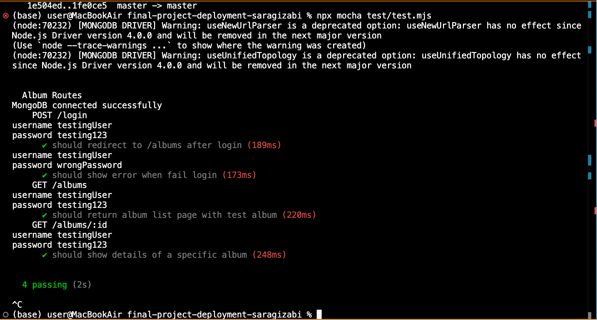

Milestone 04 - Final Project Documentation
===

NetID
---
sg7029

Name
---
Sara Gizabi

Repository Link
---
[github repo - saragizabi](https://github.com/nyu-csci-ua-0467-001-002-spring-2025/final-project-deployment-saragizabi/tree/master)

URL for deployed site 
---
[deployed site link](https://congenial-garbanzo-6996jxwwrp7xhr9w5-3000.app.github.dev/)

URL for form 1 (from previous milestone) 
---
there's a form for registering account and a form for adding a new album:
- link to adding a new album: http://localhost:3000/albums/new
- link to register account: http://localhost:3000/

Special Instructions for Form 1
---
to login you can either:
1. click on login button (initial page just leads to register form) and use these credentials --> username:testuser and password:hello123
2. register with own information --> will immidiately be redirected to main page, you can then logout and re-login with the credentials you used

URL for form 2 (for current milestone)
---
there's a form for adding songs to an existing album (created by user), can go to my reviews page, click on view details and then add songs button:
- link to adding songs to existing album: http://localhost:3000/albums/:id/add-songs

Special Instructions for Form 2
---
same login as form 1 but !!! 
- important info for testing registration -> username and password BOTH must be at least 8 characters.
test login: --> username:testuser and password:hello123

URL for form 3 (from previous milestone) 
---
there's a form (text box and button) to add a comment to an existing album, go to any album and at below the album details is the comment section:
- link to adding comment to existing album: [Comments.jsx](https://github.com/nyu-csci-ua-0467-001-002-spring-2025/final-project-deployment-saragizabi/blob/70ca82b0be4c4973a4305c4986d70fb9c65a312e/public/js/Comments.jsx#L126C7-L134C14)

Special Instructions for Form 3
---
no special instructions needed for the comment form.

First link to github line number(s) for constructor, HOF, etc.
---
- link to app.mjs file lines 271-282 [app.mjs](https://github.com/nyu-csci-ua-0467-001-002-spring-2025/final-project-deployment-saragizabi/blob/70ca82b0be4c4973a4305c4986d70fb9c65a312e/app.mjs#L272C14-L282C16)

Second link to github line number(s) for constructor, HOF, etc.
---
- link to Comments.jsx file lines 109-119 [Comments.jsx](https://github.com/nyu-csci-ua-0467-001-002-spring-2025/final-project-deployment-saragizabi/blob/70ca82b0be4c4973a4305c4986d70fb9c65a312e/public/js/Comments.jsx#L109C15-L119C18)

Short description for links above
---
- link 1: forEach is used to loop through the song (titles) and also get the ratings to add to the specified album. 
- link 2: map is used to transform an Array of Comment objects into an Array of JSX elements (to display the comments from the comments list)

Link to github line number(s) for schemas (db.js or models folder)
---
- UserSchema: lines 7-12
- SongSchema: lines 17-22
- AlbumSchema: lines 27-37
- CommentSchema: lines 41-48
- highlighted the following in [db.js](https://github.com/nyu-csci-ua-0467-001-002-spring-2025/final-project-deployment-saragizabi/blob/70ca82b0be4c4973a4305c4986d70fb9c65a312e/db.js#L7C1-L48C4)

Links to github line number(s) for research topics described above (one link per line)
---
- link to css bootstrap implementation 1: [login.hbs](https://github.com/nyu-csci-ua-0467-001-002-spring-2025/final-project-deployment-saragizabi/blob/master/views/login.hbs)
- link to css bootstrap implementation 2: [index.hbs](https://github.com/nyu-csci-ua-0467-001-002-spring-2025/final-project-deployment-saragizabi/blob/master/views/index.hbs)
- link to react implementation: [Comments.jsx](https://github.com/nyu-csci-ua-0467-001-002-spring-2025/final-project-deployment-saragizabi/blob/master/public/js/Comments.jsx)
- link to webpack (used for react): [webpack.config.js](https://github.com/nyu-csci-ua-0467-001-002-spring-2025/final-project-deployment-saragizabi/blob/master/webpack.config.js)
- link to babel (used for react): [babel.config.json](https://github.com/nyu-csci-ua-0467-001-002-spring-2025/final-project-deployment-saragizabi/blob/master/babel.config.json)
- link to mocha testing file: [test.mjs](https://github.com/nyu-csci-ua-0467-001-002-spring-2025/final-project-deployment-saragizabi/blob/master/test/test.mjs)

ss showing passed tests for mocha


Description of research topics above with points
---
1. 2 points - applied and modified "Sign-In" Bootstrap theme for register and login forms 
2. 3 points - created (and tested) 4 tests to make sure register and login, and the album create form in the app runs correctly
3. 6 points - use React to implement the comments function (post comments and display them with username + timestamps)

Optional project notes 
--- 
- IF DOESN'T RUN AUTOMATICALLY (it should but just in case):
- run: npm install
- then run: npm start
- LOGIN/REGISTER:
- important info for testing registration -> username and password BOTH must be at least 8 characters.
test login: --> username:testuser and password:hello123

Attributions
---
[mongodb atlas fxn](https://blog.appsignal.com/2023/08/09/how-to-use-mongodb-and-mongoose-for-nodejs.html) - in the db.js file i used some sample code that helped me export a fxn to make it easier to connect to mongo db atlas in my main app.mjs
```javascript
const connectDB = async () => {
    try {
        await mongoose.connect(process.env.DSN, {
            useNewUrlParser: true,
            useUnifiedTopology: true
        });
        console.log('MongoDB connected successfully');
    } catch (error) {
        console.error('MongoDB connection error:', error);
    }
};
```

[adding section to html](https://stackoverflow.com/questions/64930946/how-to-add-a-group-of-html-elements-by-a-button-click) - in the addSongs.hbs file i looked into this stack discussion when looking into how to add multiple songs at a time to form (DOM manipulation)
```javascript
<script>
    document.getElementById('add-more-btn').addEventListener('click', function() {
        const container = document.getElementById('songs-container');
        const newSongEntry = document.createElement('div');
        newSongEntry.className = 'song-entry';
        newSongEntry.innerHTML = `
            <div class="form-group">
                <label for="title">Song Title:</label>
                <input type="text" name="title" required>
            </div>
            <div class="form-group">
                <label for="rating">Rating (1-10):</label>
                <input type="number" name="rating" min="1" max="10" required>
            </div>
            <button type="button" class="remove-song-btn">Remove</button>
        `;
        container.appendChild(newSongEntry);

        // Add event listener to the remove button
        newSongEntry.querySelector('.remove-song-btn').addEventListener('click', function() {
            container.removeChild(newSongEntry);
        });
    });
</script>
```

[implementing react](https://medium.com/@raazthemystery273/setting-up-a-react-app-from-scratch-with-webpack-and-babel-fb1add2d5830) - used this website to help implement react, can also "see source code comments" mentioned in webpack.js and albumDetails.hbs
- [webpack.config.js](https://github.com/nyu-csci-ua-0467-001-002-spring-2025/final-project-deployment-saragizabi/blob/master/webpack.config.js)
- [babel.config.json](https://github.com/nyu-csci-ua-0467-001-002-spring-2025/final-project-deployment-saragizabi/blob/master/babel.config.json)
- [albumDetails.hbs](https://github.com/nyu-csci-ua-0467-001-002-spring-2025/final-project-deployment-saragizabi/blob/580030bff2d7de8e57f59490097829360557e654/views/albumDetails.hbs#L75C5-L75C50)
