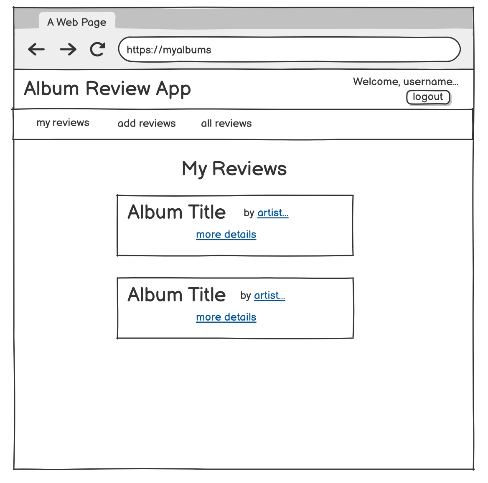
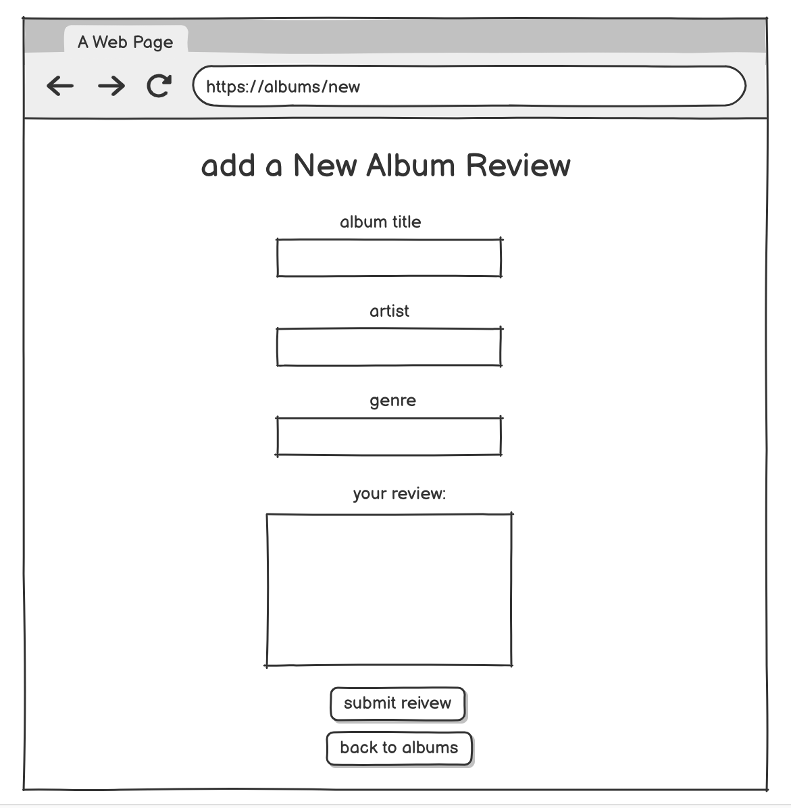
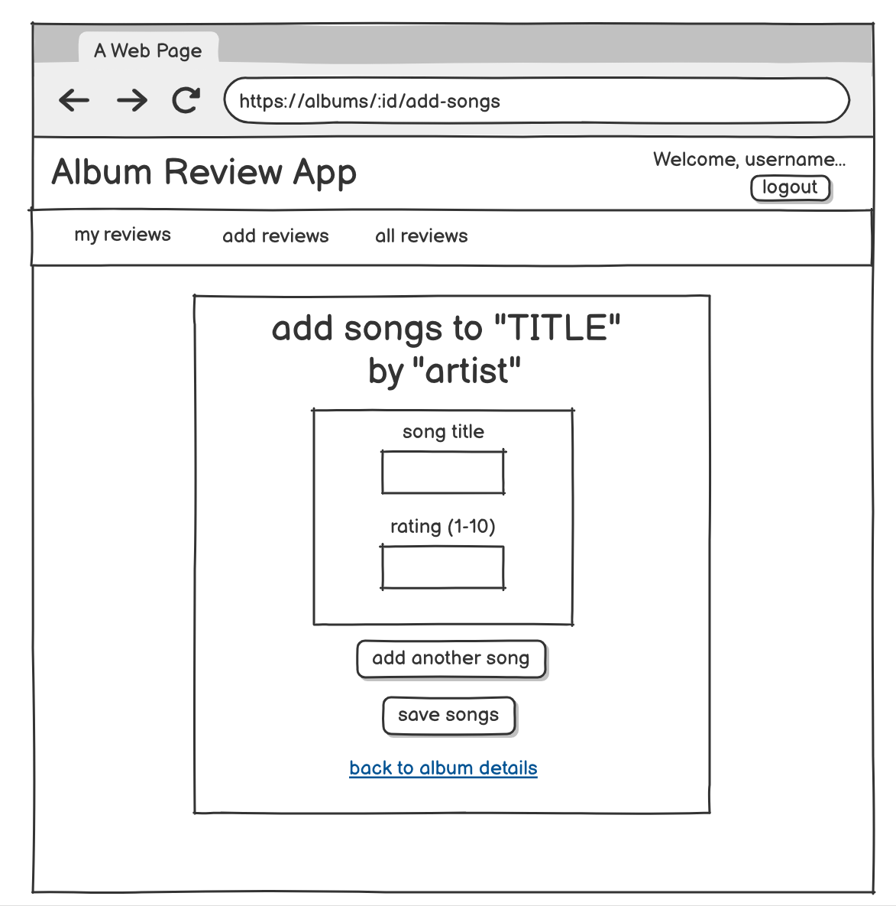
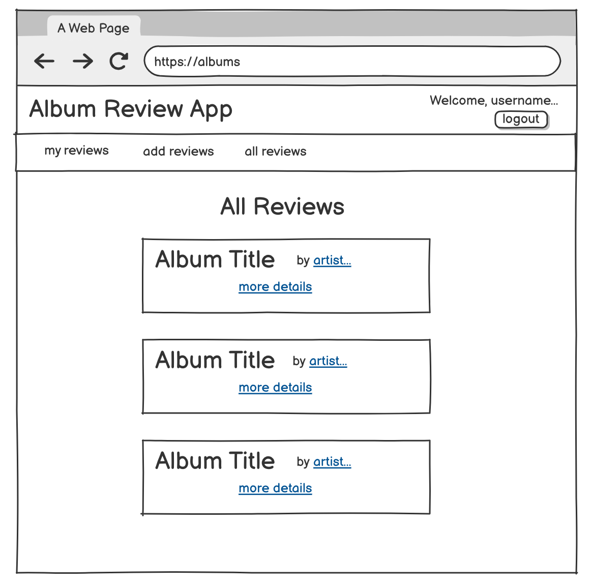
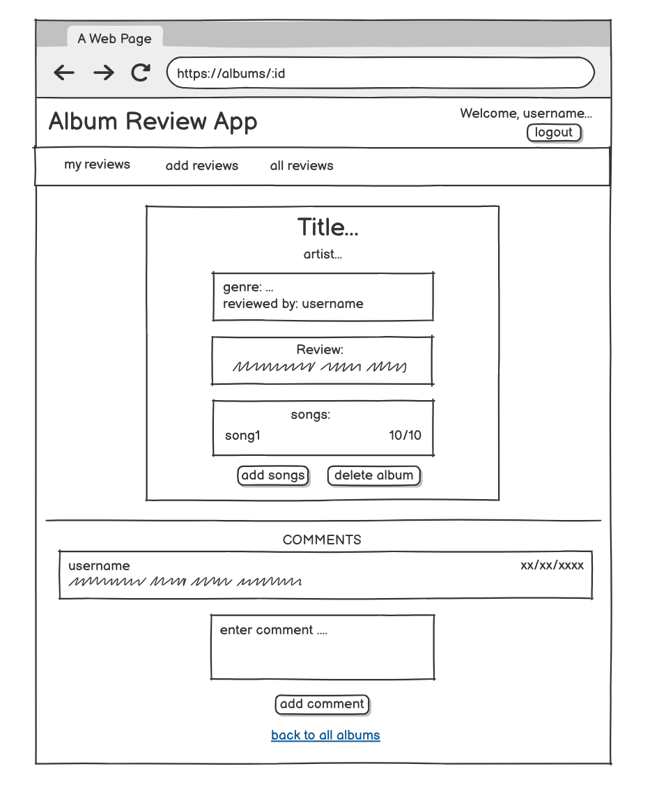
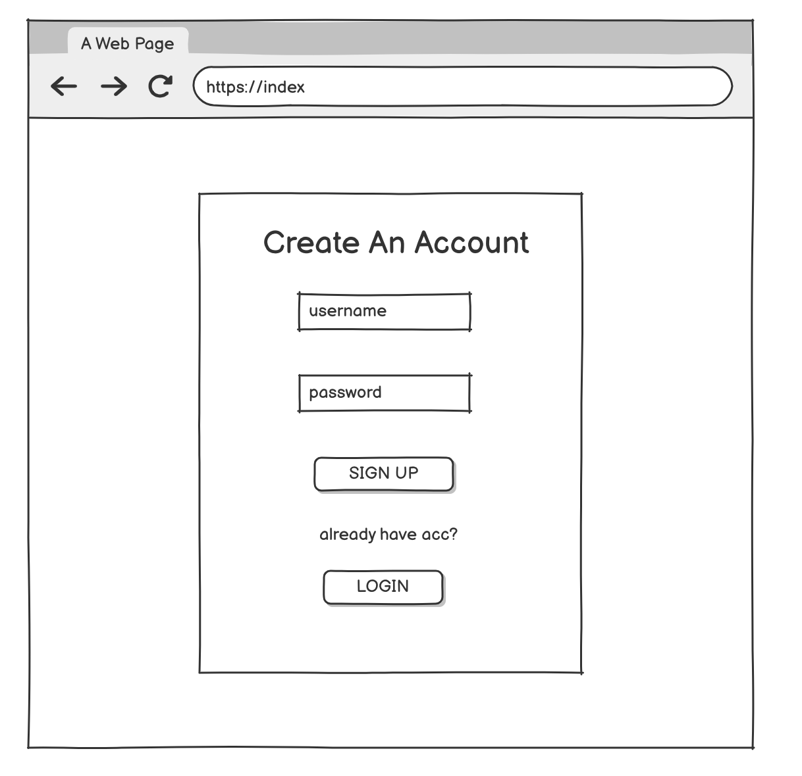
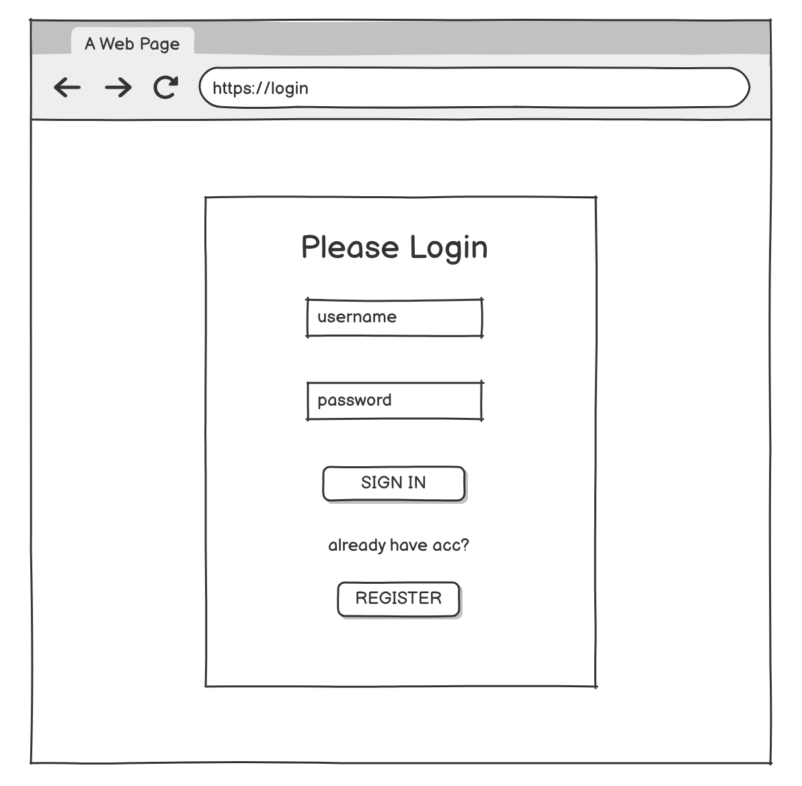
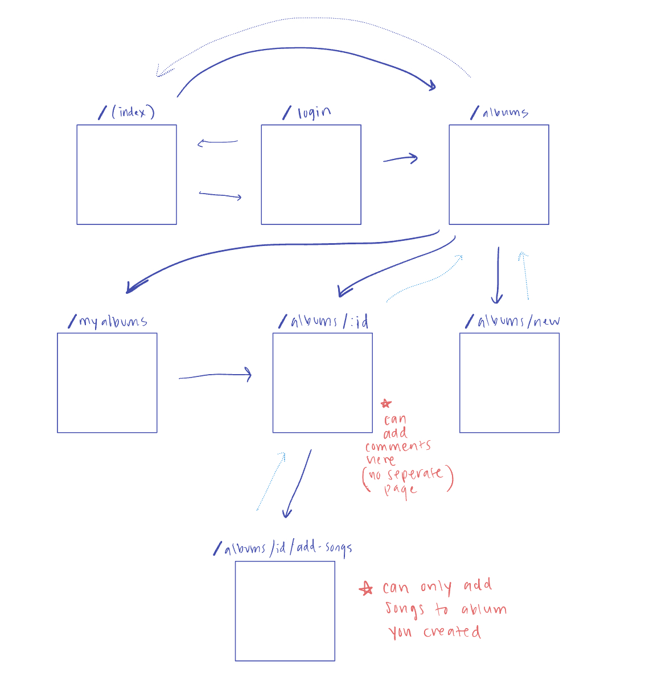

# Album Review  

## Overview

Ever experience artists you like releasing new albums back to back? It can be hard to keep track of what your favorite songs were and your commentary on the album when there’s so much music to consume every day. For all the music lovers out there that want to keep track of the albums they've listened to and their ratings of the different songs, I’ve got the app for you! 

My project would essentially be an Album Review web app that lets users review and rate albums and songs within an album. Users first register and login. Once logged in, they can create a new album, add songs (name, artists and genre) to it and assign a rating to it. Finally, they can add a description including their thoughts on it. Additionally I was thinking of having users be able to comment on other people’s reviews with their own thoughts.

## Data Model

The application will store Users, Albums, Songs, and Comments

* users can create multiple album reviews (via references)
* each album can have multiple songs (via embedding)
* each song can contain a title and rating (embedded within album)
* comments are associated with a specific album review and reference the user who posted them.


An Example User:

```javascript
{
  username: "mikeymusic",
  password: // a password hash,
  albums: // an array of references to Album documents
}
```

An Example Album with Embedded Items:

```javascript
{
  user: // a reference to a User object
  title: "OK Computer",
  artist: "Radiohead",
  genre: "Alt Rock",
  description: "A beautiful commentary on the alienation and anxieties of a modern and technologically-driven society",
  songs: [
    { title: "Let Down", rating: 10 },
    { title: "Karma Police", rating: 8 }
  ],
  comments: // an array of references to Comment documents
}
```

An Example Comment:

```javascript
{
  user: // Reference to a User
  album: // Reference to an Album
  text: "Their best album!!",
  createdAt: // add timestamp_here
}
```

## [Link to Commented First Draft Schema](db.mjs) 

first draft of my Schemas in [db.mjs](https://github.com/nyu-csci-ua-0467-001-002-spring-2025/final-project-saragizabi/blob/master/db.js)

## Wireframes

/myalbums - page for showing all your (user) album reviews 



/albums/new - page for creating new review  



/album/:id/add-songs - page for adding a song to the album review  



/albums - page for seeing all album reviews (from all users)  



/albums/:id - page that displays (anyones) album review (only the creator of review can add songs/delete the review)



/ - (index page) page that lets the user register (first register, then see everything)



/login - page that lets the user log in



## Site map

site map that shows how pages are related to each other 

## User Stories or Use Cases

1. as non-registered user, I can register a new account with the site
2. as a user, I can log in to the site
3. as a user, I can create a new album review
4. as a user, I can view all the album reviews i’ve created
5. as a user, I can name and rate different songs within the album
6. as a user, I can add comments to an existing review
7. as a user, I can view all the album reviews including those of other users

## Research Topics

* (3 points) Unit testing with JavaScript
    * Use Mocha for unit testing (at least 4 tests)
* (2 points) CSS framework 
    * Want to use Bootstrap as a framework (+ customization) for my web app
* (6 points) react 
    * I want to use react as the frontend framework, it's challenging so I've assigned it 6 points

(potential)
* Integrate user authentication:
    * use passport.js framework → 5 points

11 points total out of 10 required points 

## [Link to Initial Main Project File](app.mjs) 

skeleton Express application, link to my [app.mjs](https://github.com/nyu-csci-ua-0467-001-002-spring-2025/final-project-saragizabi/blob/master/app.mjs)

## Annotations / References Used

1. [react.js](https://react.dev/learn/describing-the-ui) - havent incorporated yet but will use info from here for UI, etc.
2. [connecting to mongo db atlas](https://blog.appsignal.com/2023/08/09/how-to-use-mongodb-and-mongoose-for-nodejs.html) - checked out this website on how to incorporate mongo db atlas to my app.mjs (referenced fxn)
